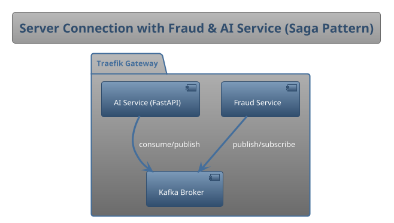

# Caravanes FastAPI

## Overview

Caravanes is a **microservices-based system** with two main services, orchestrated via **Traefik Gateway** and communicating through **Kafka**:

- **Fraud Service** → Handles fraud detection workflows and orchestrates events.  
- **AI Service (FastAPI)** → Provides AI-powered OCR, damage estimation, and license ID detection.  

---

## Architecture (Saga Pattern with Kafka)



---

## Quickstart

1. Clone the repository  
```bash
git clone <your-repo-url>
cd caravanes
```

2. Start with Docker Compose (includes Traefik + Kafka)  
```bash
docker compose up --build
```

3. Access services:
- Fraud Service → `http://localhost/fraud`  
- AI Service (FastAPI) → `http://localhost/ai`  
- Traefik Dashboard → `http://localhost:8080`  

---

## API Endpoints (AI Service)

### Health
- `GET /health` → Health check  
---

### Damage Price Search
- `POST /damage/search-part-prices` → Estimate damaged part prices from **single image**  
- `POST /damage/search-multi-angle-prices` → Estimate prices from **4 angles** (front, back, left, right)  
- `POST /damage/search-custom-angle-prices` → Estimate prices from **custom angles**  

**Features:**
- AI-powered part identification (Gemini Vision)  
- Real-time price lookup (autoparts.com, RockAuto, PartsGeek, Amazon, Google Shopping)  
- Price aggregation: min / max / avg  
- Car-specific results with make, model, year  
- Comprehensive cost estimation  

---

### License ID Detection (YOLO)
- `POST /license/detect` → Detect license IDs in one image  
- `POST /license/extract` → Extract user info from license ID 

**YOLO Training Workflow:**
1. Add training images → `datasets/license_id/images/train/`  
2. Add validation images → `datasets/license_id/images/val/`  
3. Add labels → `datasets/license_id/labels/...`  
4. Train the model:  
   ```bash
   cd datasets/license_id
   python train_yolo.py
   ```
5. Export & test:  
   ```bash
   python export_and_test_yolo.py
   ```

---

## Project Structure

```
caravanes/
├── ai_service/        # FastAPI service
│   ├── ocr/           # OCR with Gemini API
│   ├── damage/        # Damage price search
│   ├── DockerFile     #DockerFIle for each service 
│   └── ...
├── fraud_service/     # Fraud orchestration + Kafka events
├──├── docker-compose.yml
└── README.md
```

---

## Tech Stack
- **FastAPI** (AI Service APIs)  
- **YOLO** (detection)  
- **Kafka** (Event streaming between services)  
- **Traefik Gateway** (Service routing & gateway)  
- **Docker Compose** (Container orchestration)  

---

## License
MIT License